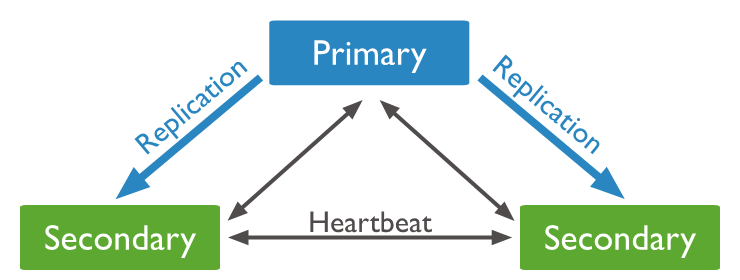

kubectl apply -f k8s/

kubectl get po -n mongo -w

kubectl get sts -n mongo 

kubectl get pvc -n mongo

# set replication for mongo cluster and pod.



rs.initiate( {
   _id : "rs0",
   members: [
      { _id: 0, host: "mongodb0.example.net:27017" },
      { _id: 1, host: "mongodb1.example.net:27017" },
      { _id: 2, host: "mongodb2.example.net:27017" }
   ]
})

--------------------------

explaining of host:
<pod_name>.<service_name>.<namepspace_name>.svc.cluster:27017
mongo-db-0.mongo-db.mongo.svc.cluster:2701

-------------------------
You're on the right track with the `rs.initiate()` command, but there are a couple of issues in your example:

1. **Hostnames**: Make sure that you're using the correct hostnames for your MongoDB pods. If you're using a StatefulSet, the hostnames for each pod should reflect their index. For example, `mongo-db-0`, `mongo-db-1`, etc.

2. **Unique IDs**: Each member in the replica set must have a unique `_id`. You should not use the same `_id` for multiple members.

Here’s a corrected example for your `rs.initiate()` command:

```javascript
rs.initiate({
   _id: "rs0",
   members: [
      { _id: 0, host: "mongo-db-0.mongo-db.mongo.svc.cluster.local:27017" },
      { _id: 1, host: "mongo-db-1.mongo-db.mongo.svc.cluster.local:27017" },
      { _id: 2, host: "mongo-db-2.mongo-db.mongo.svc.cluster.local:27017" }
   ]
});
```

### Key Points:
- Make sure to include all members of your replica set in the `members` array.
- The hostnames should be in the format `pod-name.service-name.namespace.svc.cluster.local` for proper DNS resolution within the cluster.
- Ensure that the number of replicas in your StatefulSet matches the number of members you specify in the replica set configuration.

### Steps to Execute:
1. Connect to one of your MongoDB pods:
   ```bash
   kubectl exec -it mongo-db-0 -n mongo -- mongosh -u rahul -p your_password --authenticationDatabase admin
   ```

2. Run the corrected `rs.initiate()` command.

3. Verify the status with:
   ```javascript
   rs.status();
   ```
------------------------------------------------

To automatically set up replication when your MongoDB container starts, you can't directly include the `rs.initiate()` command in a ConfigMap, as it won't be executed automatically. However, you can use a couple of methods to ensure replication is set up on startup:

### Option 1: Init Container
You can create an **init container** that runs the `rs.initiate()` command before the MongoDB container starts. Here’s how you can do that:

1. **Modify the StatefulSet** to include an init container:

```yaml
apiVersion: apps/v1
kind: StatefulSet
metadata:
  name: mongo-db
  namespace: mongo
spec:
  replicas: 3
  serviceName: mongo-db
  selector:
    matchLabels:
      app: mongo-db
  template:
    metadata:
      labels:
        app: mongo-db
    spec:
      initContainers:
      - name: mongo-init
        image: mongo:latest
        command: ['mongosh', '--eval', 'rs.initiate({ _id: "rs0", members: [{ _id: 0, host: "mongo-db-0.mongo-db.mongo.svc.cluster.local:27017" }, { _id: 1, host: "mongo-db-1.mongo-db.mongo.svc.cluster.local:27017" }, { _id: 2, host: "mongo-db-2.mongo-db.mongo.svc.cluster.local:27017" }] });']
        env:
          - name: MONGO_INITDB_ROOT_USERNAME
            valueFrom:
              configMapKeyRef:
                key: username
                name: mongo-scripts
          - name: MONGO_INITDB_ROOT_PASSWORD
            valueFrom:
              secretKeyRef:
                key: password
                name: mongodb-secret
        # Make sure to wait until the MongoDB pods are ready
        readinessProbe:
          exec:
            command:
            - mongo
            - --eval
            - 'printjson(rs.status())'
          initialDelaySeconds: 5
          periodSeconds: 10
      containers:
      - name: mongo
        image: mongo:latest
        # Your existing MongoDB container settings...
```

### Option 2: Startup Script in the Main Container
Another approach is to use a startup script in the main MongoDB container that checks if the replica set has been initialized and initializes it if not.

1. Create a shell script that will run on startup:

```bash
#!/bin/bash

# Wait for MongoDB to start
until mongo --eval "print(\"waited for connection\")"; do
  sleep 2
done

# Initialize replica set if not already done
if [[ "$(mongo --quiet --eval 'rs.status()')" == "" ]]; then
  mongo --eval 'rs.initiate({ _id: "rs0", members: [{ _id: 0, host: "mongo-db-0.mongo-db.mongo.svc.cluster.local:27017" }, { _id: 1, host: "mongo-db-1.mongo-db.mongo.svc.cluster.local:27017" }, { _id: 2, host: "mongo-db-2.mongo-db.mongo.svc.cluster.local:27017" }] });'
fi

# Start the MongoDB server
exec mongod --bind_ip_all --config=/etc/mongo/mongodb.conf
```

2. Add this script to your container and change the command to run the script:

```yaml
containers:
- name: mongo
  image: mongo:latest
  command: ["/path/to/startup-script.sh"]
  # Other settings...
```

### Conclusion
Using an init container is a clean approach that separates the initialization logic, while embedding the logic directly in the main container offers more flexibility. Choose the method that best fits your application's needs!


-------------------------------------------


kubectl exec -it mongo-db-0 -n mongo -- mongosh -u rahul -p password123 --authenticationDatabase admin
